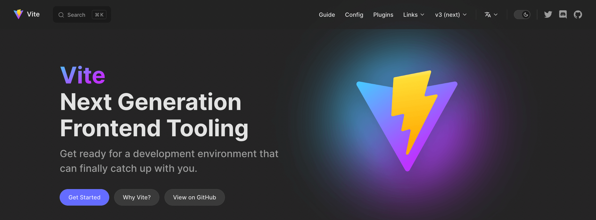
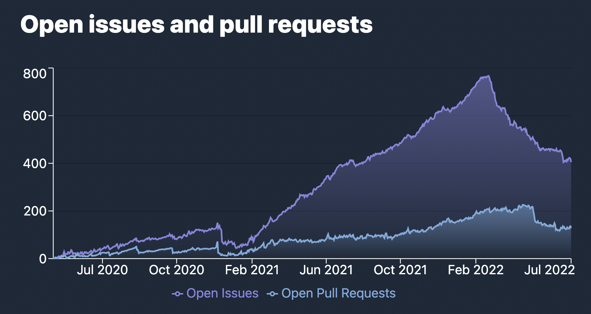

# Vite 3.0 est sorti !

_23 Juillet, 2022_ - Consultez l'annonce de la sortie de [Vite 4.0](./announcing-vite4.md)

En février dernier, [Evan You](https://twitter.com/youyuxi) a publié Vite 2. Depuis, son adoption a continué de croître sans cesse, atteignant plus d'1 million de téléchargements par semaine. Un écosystème étendu s'est rapidement formé après sa sortie. Vite est à l'origine d'une course à la réinvention dans le monde des frameworks Web. [Nuxt 3](https://v3.nuxtjs.org/) utilise Vite par défaut. [SvelteKit](https://kit.svelte.dev/), [Astro](https://astro.build/), [Hydrogen](https://hydrogen.shopify.dev/), et [SolidStart](https://docs.solidjs.com/quick-start) sont tous construits avec Vite. [Laravel a décidé d'utiliser Vite par défaut](https://laravel.com/docs/9.x/vite). [Vite Ruby](https://vite-ruby.netlify.app/) montre comment Vite peut améliorer l'expérience de développement de Rails. [Vitest](https://vitest.dev) progresse comme une alternative Vite-native à Jest. Vite est derrière les nouvelles fonctionnalités de [Cypress](https://docs.cypress.io/guides/component-testing/writing-your-first-component-test) et les nouvelles fonctionnalités de tests de composant de [Playwright](https://playwright.dev/docs/test-components), Storybook a [Vite comme constructeur officiel](https://github.com/storybookjs/builder-vite). Et [la liste continue](https://patak.dev/vite/ecosystem.html). Les responsables de la plupart de ces projets ont participé à l'amélioration du noyau Vite en travaillant de près avec le [team](https://vite.dev/team) et d'autres contributeurs.


Aujourd'hui, 16 mois après le lancement de Vite 2, nous sommes heureux de publier Vite 3. Nous avons décidé de publier une nouvelle version majeure de Vite au moins tous les ans pour nous aligner avec [Node.js's EOL](https://nodejs.org/en/about/releases/), et prendre l'opportunité de réexaminer régulièrement l'API de Vite avec un chemin de migration court pour les projets de l'écosystème.

Liens rapides :

- [Docs](/)
- [Guide de migration](https://v3.vite.dev/guide/migration.html)
- [Changelog](https://github.com/vitejs/vite/blob/main/packages/vite/CHANGELOG.md#300-2022-07-13)

Si vous êtes nouveau dans Vite, nous vous recommandons de lire le [Guide pourquoi Vite](https://vite.dev/guide/why.html). Ensuite, consultez [le guide de démarrage](https://vite.dev/guide/) et le [Guide des fonctionnalités](https://vite.dev/guide/features) pour voir ce que Vite fournit par défaut. Comme d'habitude, les contributions sont bienvenues sur [GitHub](https://github.com/vitejs/vite). Plus de [600 contributeurs](https://github.com/vitejs/vite/graphs/contributors) ont contribué à améliorer Vite jusqu'à présent. Suivez les mises à jour sur [Twitter](https://twitter.com/vite_js), ou rejoignez les discussions avec d'autres utilisateurs de Vite sur notre [serveur de chat Discord](http://chat.vite.dev/).

## Nouvelles documentations

Consultez [vite.dev](https://vite.dev) pour profiter des nouvelles documentations de Vite 3. Vite utilise maintenant le nouveau [VitePress](https://vitepress.vuejs.org) thème par défaut, avec un mode sombre entre autres fonctionnalités.

[](https://vite.dev)

Plusieurs projets de l'écosystème ont déjà migré vers le nouveau thème (voir [Vitest](https://vitest.dev), [vite-plugin-pwa](https://vite-plugin-pwa.netlify.app/), et [VitePress](https://vitepress.vuejs.org/) lui-même).

Si vous avez besoin d'accéder aux documentations de Vite 2, elles resteront en ligne sur [v2.vite.dev](https://v2.vite.dev). Il existe également un nouveau sous-domaine [main.vite.dev](https://main.vite.dev), où chaque commit à la branche principale de Vite est automatiquement déployé. Cela est utile lorsque vous testez des versions bêta ou contribuez au développement du noyau.

Il existe également une traduction officielle espagnole, qui a été ajoutée aux traductions précédentes en chinois et japonais :

- [简体中文](https://cn.vite.dev/)
- [日本語](https://ja.vite.dev/)
- [Español](https://es.vite.dev/)

## Create Vite Starter Templates

Les [templates de démarrage de create-vite](/guide/#trying-vite-online) ont été un outil formidable pour tester rapidement Vite avec votre framework préféré. Dans Vite 3, tous les templates ont reçu un nouveau thème en ligne avec les nouvelles documentations. Ouvrez-les en ligne et commencez à jouer avec Vite 3 maintenant :

<div class="stackblitz-links">
<a target="_blank" href="https://vite.new"></a>
<a target="_blank" href="https://vite.new/vue"></a>
<a target="_blank" href="https://vite.new/svelte"></a>
<a target="_blank" href="https://vite.new/react"></a>
<a target="_blank" href="https://vite.new/preact"></a>
<a target="_blank" href="https://vite.new/lit"></a>
</div>

<style>
.stackblitz-links {
  display: flex;
  width: 100%;
  justify-content: space-around;
  align-items: center;
}
@media screen and (max-width: 550px) {
  .stackblitz-links {
    display: grid;
    grid-template-columns: 1fr 1fr 1fr;
    width: 100%;
    gap: 2rem;
    padding-left: 3rem;
    padding-right: 3rem;
  }
}
.stackblitz-links > a {
  width: 70px;
  height: 70px;
  display: grid;
  align-items: center;
  justify-items: center;
}
.stackblitz-links > a:hover {
  filter: drop-shadow(0 0 0.5em #646cffaa);
}
</style>

Le thème est maintenant partagé par tous les templates. Cela devrait aider à mieux illustrer le champ d'application de ces templates en tant que templates minimaux pour commencer avec Vite. Pour des solutions plus complètes incluant le linting, le setup de tests, et d'autres fonctionnalités, il existe des templates officiels Vite pour certains frameworks comme [create-vue](https://github.com/vuejs/create-vue) et [create-svelte](https://github.com/sveltejs/kit). Il existe également une liste maintenue par la communauté de templates sur [Awesome Vite](https://github.com/vitejs/awesome-vite#templates).

## Améliorations de l'environnement de développement

### Vite CLI

<pre style="background-color: var(--vp-code-block-bg);padding:2em;border-radius:8px;max-width:100%;overflow-x:auto;">
  <span style="color:lightgreen"><b>VITE</b></span> <span style="color:lightgreen">v3.0.0</span>  <span style="color:gray">ready in <b>320</b> ms</span>

  <span style="color:lightgreen"><b>➜</b></span>  <span style="color:white"><b>Local</b>:</span>   <span style="color:cyan">http://127.0.0.1:5173/</span>
  <span style="color:green"><b>➜</b></span>  <span style="color:gray"><b>Network</b>: use --host to expose</span>
</pre>

Outre les améliorations esthétiques du CLI, vous remarquerez que le port du serveur de développement par défaut est maintenant 5173 et le serveur de prévisualisation écoute le port 4173. Ce changement garantit que Vite évitera les collisions avec d'autres outils.

### Stratégie de connexion WebSocket améliorée

Un des points de frustration de Vite 2 était la configuration du serveur lors de l'exécution derrière un proxy. Vite 3 change la stratégie de connexion par défaut pour qu'elle fonctionne sans configuration dans la plupart des scénarios. Tous ces setups sont maintenant testés comme partie du Vite Ecosystem CI via [`vite-setup-catalogue`](https://github.com/sapphi-red/vite-setup-catalogue).

### Améliorations de la vitesse de démarrage

Vite évite maintenant le rechargement complet lors du démarrage froid lorsque les imports sont injectés par des plugins pendant le balayage des modules importés statiquement initialement ([#8869](https://github.com/vitejs/vite/issues/8869)).

<details>
  <summary><b>Cliquer pour en savoir plus</b></summary>

Dans Vite 2.9, les deux scanners et optimisateurs étaient exécutés en arrière-plan. Dans le meilleur scénario, où le scanner trouverait chaque dépendance, aucun rechargement n'était nécessaire au démarrage froid. Mais si le scanner manquait une dépendance, un nouvel algorithme d'optimisation et un rechargement étaient nécessaires. Vite a été en mesure d'éviter certains de ces rechargements dans v2.9, car nous avons pu détecter si les nouveaux chunks optimisés étaient compatibles avec ceux que le navigateur avait. Mais si une dépendance commune manquait, les sous-chunks pourraient changer et un rechargement serait nécessaire pour éviter un état dupliqué. Dans Vite 3, les dépendances optimisées ne sont pas envoyées au navigateur avant le balayage des imports statiques. Une phase d'optimisation rapide est émise si une dépendance manque (par exemple, injectée par un plugin), et uniquement dans ce cas, les dépendances optimisées sont envoyées. Donc, un rechargement de page n'est plus nécessaire pour ces cas.

</details>


### import.meta.glob

La prise en charge de `import.meta.glob` a été réécrite. Lisez les nouvelles fonctionnalités dans le [Guide des imports globaux](/guide/features.html#glob-import):

[Les patterns multiples](/guide/features.html#multiple-patterns) peuvent être passés comme un tableau

```js
import.meta.glob(['./dir/*.js', './another/*.js'])
```

[Les patterns négatifs](/guide/features.html#negative-patterns) sont maintenant supportés (préfixés avec `!`) pour ignorer certains fichiers spécifiques

```js
import.meta.glob(['./dir/*.js', '!**/bar.js'])
```

[Les imports nommés](/guide/features.html#named-imports) peuvent être spécifiés pour améliorer le tree-shaking

```js
import.meta.glob('./dir/*.js', { import: 'setup' })
```

[Les requêtes personnalisées](/guide/features.html#custom-queries) peuvent être passées pour attacher des métadonnées

```js
import.meta.glob('./dir/*.js', { query: { custom: 'data' } })
```

Les [Eager Imports](/guide/features.html#glob-import) sont maintenant passés comme un flag

```js
import.meta.glob('./dir/*.js', { eager: true })
```

### Alignement avec les standards futurs pour les imports WASM

L'API d'importation WASM a été revue pour éviter les collisions avec les standards futurs et pour la rendre plus flexible :

```js
import init from './example.wasm?init'

init().then((instance) => {
  instance.exports.test()
})
```

En savoir plus dans le [Guide WASM](/guide/features.html#webassembly)

## Améliorations de la construction

### ESM SSR Build par défaut

La plupart des frameworks SSR dans l'écosystème utilisaient déjà des builds ESM. Donc, Vite 3 fait de l'ESM le format par défaut pour les builds SSR. Cela permet de simplifier les heuristiques d'[externalisation SSR](https://vite.dev/guide/ssr.html#ssr-externals) précédentes, externalisant les dépendances par défaut.

### Améliorations de la prise en charge de la base relative

Vite 3 prend en charge correctement la base relative (en utilisant `base: ''`), permettant aux assets construits d'être déployés sur différentes bases sans re-construction. Cela est utile lorsque la base n'est pas connue au moment du build, par exemple lors du déploiement sur des réseaux de distribution de contenu comme [IPFS](https://ipfs.io/).

## Fonctionnalités expérimentales

### Contrôle de chemin de fichier construit (Expérimental)

Il existe d'autres scénarios de déploiement où cela ne suffit pas. Par exemple, si les assets générés avec hash nécessitent d'être déployés sur un autre CDN que les fichiers publics, alors un contrôle plus fin sur la génération de chemins est nécessaire au moment du build. Vite 3 fournit une API expérimentale pour modifier les chemins des fichiers construits. En savoir plus dans [Options avancées de base de construction](/guide/build.html#advanced-base-options).

### Optimisation des dépendances à la construction avec esbuild (Expérimental)

Une des principales différences entre le développement et le build est la façon dont Vite gère les dépendances. Pendant la construction, [`@rollup/plugin-commonjs`](https://github.com/rollup/plugins/tree/master/packages/commonjs) est utilisé pour permettre l'importation de dépendances CJS uniquement (comme React). Lors de l'utilisation du serveur de développement, esbuild est utilisé à la place pour pré-bundler et optimiser les dépendances, et un schéma d'interopération en ligne est appliqué pendant la transformation du code utilisateur important des dépendances CJS. Pendant le développement de Vite 3, nous avons introduit les modifications nécessaires pour permettre également l'utilisation de [esbuild pour optimiser les dépendances pendant le build](https://v3.vite.dev/guide/migration.html#using-esbuild-deps-optimization-at-build-time). [`@rollup/plugin-commonjs`](https://github.com/rollup/plugins/tree/master/packages/commonjs) peut alors être évité, faisant en sorte que le développement et le build fonctionnent de la même manière.

Étant donné que Rollup v3 sortira dans les prochains mois, et que nous allons suivre avec une autre version majeure de Vite, nous avons décidé de rendre ce mode optionnel pour réduire la portée de v3 et donner plus de temps à Vite et l'écosystème pour travailler sur les problèmes possibles avec la nouvelle approche d'interopération CJS pendant le build. Les frameworks peuvent basculer vers l'utilisation de l'optimisation des dépendances esbuild pendant le build par défaut à leur propre rythme avant la sortie de Vite 4.

### HMR Partial Accept (Expérimental)

Il existe un support integré pour [HMR Partial Accept](https://github.com/vitejs/vite/pull/7324). Cette fonctionnalité pourrait débloquer un HMR plus fin pour les composants de framework qui exportent plusieurs liaisons dans le même module. En savoir plus sur [la discussion pour cette proposition](https://github.com/vitejs/vite/discussions/7309).

## Réduction de la taille du bundle

Vite s'occupe de son empreinte de publication et d'installation ; une installation rapide d'une nouvelle application est une fonctionnalité. Vite regroupe la plupart de ses dépendances et essaie d'utiliser des alternatives modernes légères si possible. En poursuivant cet objectif, la taille de publication de Vite 3 est 30% plus petite que v2.

|             | Taille de publication | Taille d'installation |
| ----------- | :----------: | :----------: |
| Vite 2.9.14 |    4.38MB    |    19.1MB    |
| Vite 3.0.0  |    3.05MB    |    17.8MB    |
| Réduction   |     -30%     |     -7%      |

En partie, cette réduction a été possible en rendant certaines dépendances optionnelles pour la plupart des utilisateurs. Premièrement, [Terser](https://github.com/terser/terser) n'est plus installé par défaut. Cette dépendance n'était plus nécessaire depuis que nous avons fait d'esbuild le minificateur par défaut pour les deux JS et CSS dans Vite 2. Si vous utilisez `build.minify: 'terser'`, vous devez l'installer (`npm add -D terser`). Nous avons également déplacé [node-forge](https://github.com/digitalbazaar/forge) hors du monorepo, en implémentant le support pour la génération automatique de certificats HTTPS en tant que nouveau plugin : [`@vitejs/plugin-basic-ssl`](https://v3.vite.dev/guide/migration.html#automatic-https-certificate-generation). Étant donné que cette fonctionnalité n'a créé que des certificats non fiables qui ne sont pas ajoutés au store local, elle n'a pas justifié la taille supplémentaire.

## Correction des bugs

Un triage marathon a été lancé par [@bluwyoo](https://twitter.com/bluwyoo), [@sapphi_red](https://twitter.com/sapphi_red), qui ont rejoint l'équipe Vite récemment. Durant les trois derniers mois, les problèmes ouverts de Vite ont été réduits de 770 à 400. Et cette réduction a été atteinte alors que le nombre de PRs ouvertes était à son maximum. À la même époque, [@haoqunjiang](https://twitter.com/haoqunjiang) avait également élaboré une vue d'ensemble complète des problèmes de Vite : [Vue d'ensemble des problèmes de Vite](https://github.com/vitejs/vite/discussions/8232).

[](https://www.repotrends.com/vitejs/vite)

[](https://www.repotrends.com/vitejs/vite)

## Notes de compatibilité

- Vite ne supporte plus Node.js 12 / 13 / 15, qui a atteint son EOL. Node.js 14.18+ / 16+ est maintenant requis.
- Vite est maintenant publié en tant que ESM, avec un proxy CJS vers l'entrée ESM pour la compatibilité.
- La ligne de base des navigateurs modernes cible maintenant les navigateurs qui prennent en charge les [modules ES natifs](https://caniuse.com/es6-module), [native ESM dynamic import](https://caniuse.com/es6-module-dynamic-import), et les fonctionnalités [`import.meta`](https://caniuse.com/mdn-javascript_operators_import_meta).
- Les extensions de fichiers JS dans le mode SSR et en mode bibliothèque utilisent maintenant une extension valide (`js`, `mjs`, ou `cjs`) pour les entrées et les chunks de sortie JS en fonction de leur format et du type de package.

En savoir plus dans le [Guide de migration](https://v3.vite.dev/guide/migration.html).

## Améliorations de Vite Core

Alors que nous travaillions vers Vite 3, nous avons également amélioré l'expérience de contribution pour les collaborateurs de [Vite Core](https://github.com/vitejs/vite).

- Les tests unitaires et E2E ont été migrés vers [Vitest](https://vitest.dev), fournissant une expérience de développement plus rapide et plus stable. Cette migration fonctionne également comme un test pour un projet infrastructure important dans l'écosystème.
- Le build de VitePress est maintenant testé dans la CI.
- Vite a été mis à jour vers [pnpm 7](https://pnpm.io/), suivant le reste de l'écosystème.
- Les playgrounds ont été déplacés hors du répertoire des packages dans [`/playgrounds`](https://github.com/vitejs/vite/tree/main/playground).
- Les packages et les playgrounds sont maintenant `"type": "module"`.
- Les plugins sont maintenant regroupés en utilisant [unbuild](https://github.com/unjs/unbuild), [plugin-vue-jsx](https://github.com/vitejs/vite-plugin-vue/tree/main/packages/plugin-vue-jsx) et [plugin-legacy](https://github.com/vitejs/vite/tree/main/packages/plugin-legacy) ont été déplacés vers TypeScript.

## L'écosystème est prêt pour v3

Nous avons travaillé de près avec les projets de l'écosystème pour s'assurer que les frameworks alimentés par Vite sont prêts pour Vite 3. [vite-ecosystem-ci](https://github.com/vitejs/vite-ecosystem-ci) nous permet de lancer les CI des principaux joueurs de l'écosystème contre le main branch de Vite et de recevoir des rapports en temps réel avant de présenter une régression. Aujourd'hui, cette sortie devrait être compatible avec la plupart des projets utilisant Vite.

## Remerciements

Vite 3 est le résultat du travail collectif des membres du [Vite Team](/team) travaillant ensemble avec les responsables de projets de l'écosystème et d'autres collaborateurs pour le noyau de Vite.

Nous voulons remercier toutes les personnes qui ont implémenté des fonctionnalités, corrigé des bugs, donné des retours, et ont été impliquées dans Vite 3 :

- Les membres de l'équipe Vite [@youyuxi](https://twitter.com/youyuxi), [@patak_dev](https://twitter.com/patak_dev), [@antfu7](https://twitter.com/antfu7), [@bluwyoo](https://twitter.com/bluwyoo), [@sapphi_red](https://twitter.com/sapphi_red), [@haoqunjiang](https://twitter.com/haoqunjiang), [@poyoho](https://github.com/poyoho), [@Shini_92](https://twitter.com/Shini_92), et [@retropragma](https://twitter.com/retropragma).
- [@benmccann](https://github.com/benmccann), [@danielcroe](https://twitter.com/danielcroe), [@brillout](https://twitter.com/brillout), [@sheremet_va](https://twitter.com/sheremet_va), [@userquin](https://twitter.com/userquin), [@enzoinnocenzi](https://twitter.com/enzoinnocenzi), [@maximomussini](https://twitter.com/maximomussini), [@IanVanSchooten](https://twitter.com/IanVanSchooten), l'équipe [Astro](https://astro.build/), et tous les responsables de frameworks et de plugins dans l'écosystème qui ont contribué à la mise en place de v3.
- [@dominikg](https://github.com/dominikg) pour son travail sur vite-ecosystem-ci.
- [@ZoltanKochan](https://twitter.com/ZoltanKochan) pour son travail sur [pnpm](https://pnpm.io/), et pour sa réactivité lorsque nous avons eu besoin de son support.
- [@rixo](https://github.com/rixo) pour le support de HMR Partial Accept.
- [@KiaKing85](https://twitter.com/KiaKing85) pour avoir préparé le thème pour la sortie de Vite 3, et [@\_brc_dd](https://twitter.com/_brc_dd) pour travailler sur les internals de VitePress.
- [@CodingWithCego](https://twitter.com/CodingWithCego) pour la traduction espagnole, et [@ShenQingchuan](https://twitter.com/ShenQingchuan), [@hiro-lapis](https://github.com/hiro-lapis) et d'autres membres des équipes de traduction en chinois et japonais pour maintenir les documentations traduites à jour.

Nous voulons également remercier les individus et les entreprises qui soutiennent l'équipe Vite, et les entreprises qui investissent dans le développement de Vite : une partie du travail de [@antfu7](https://twitter.com/antfu7) sur Vite et l'écosystème est son travail à [Nuxt Labs](https://nuxtlabs.com/), et [StackBlitz](https://stackblitz.com/) a embauché [@patak_dev](https://twitter.com/patak_dev) pour travailler à plein temps sur Vite.

## Qu'en est-il de la prochaine version majeure ?

Nous allons prendre les prochains mois pour nous assurer que la transition sera fluide pour tous les projets construits sur Vite. Donc, les premières majeures seront concentrées sur la continuation de nos efforts de triage avec un focus sur les nouveaux problèmes ouverts.

L'équipe Rollup [travaille sur sa prochaine majeure](https://twitter.com/lukastaegert/status/1544186847399743488), qui sera publiée dans les prochains mois. Une fois que l'écosystème des plugins Rollup aura le temps de mettre à jour, nous ferons suivre avec une nouvelle majeure de Vite. Cela nous donnera une autre opportunité de présenter des changements plus significatifs cette année, ce que nous pourrions prendre pour stabiliser certaines fonctionnalités expérimentales introduites dans cette version.

Si vous êtes intéressé pour améliorer Vite, la meilleure façon de vous impliquer est de contribuer au triage des problèmes. Rejoignez [notre serveur Discord](https://chat.vite.dev) et cherchez le canal `#contributing`. Ou participez à nos `#docs`, `#help` d'autres, ou créez des plugins. Nous sommes juste au début. Il y a beaucoup d'idées ouvertes pour améliorer l'expérience de développement de Vite.
